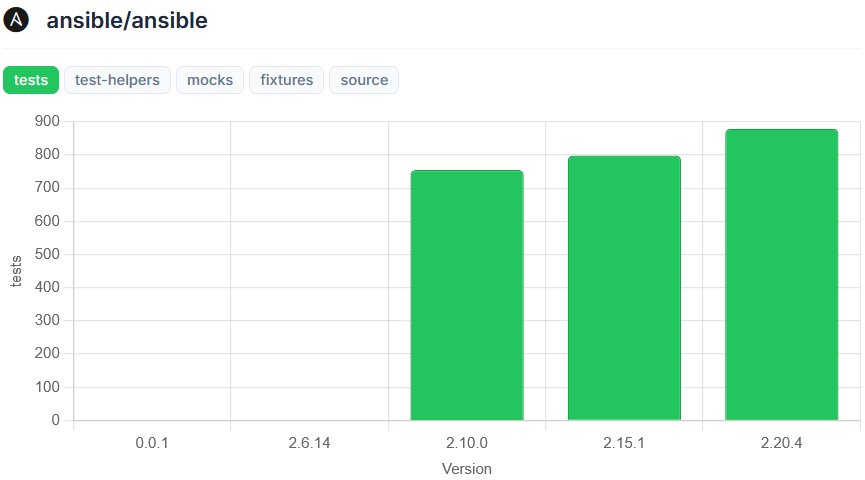

# Explorando Práticas de Teste

Neste exercício, vamos explorar práticas de teste em sistemas reais utilizando a ferramenta [TestMiner](https://andrehora.github.io/testminer).

O TestMiner permite visualizar e analisar testes de software em repositórios do GitHub, fornecendo dados sobre como os projetos organizam seus testes, como eles evoluem entre versões e quais bibliotecas de teste são utilizadas.
Explore a ferramenta antes de começar para se familiarizar com seu funcionamento.

---

## Passo 1: Selecionar um repositório

Escolha um repositório real que possua testes escritos na linguagem de sua preferência.
Abaixo estão alguns links para ajudá-lo a encontrar projetos interessantes:

- **Python:** https://github.com/topics/python?l=python
- **JavaScript:** https://github.com/topics/javascript?l=javascript
- **TypeScript:** https://github.com/topics/typescript?l=typescript
- **Java:** https://github.com/topics/java?l=java

## Passo 2: Explorar o repositório selecionado

Busque o repositório escolhido no [TestMiner](https://andrehora.github.io/testminer) e analise os dados de teste gerados pela ferramenta.

## Passo 3: Explicar uma prática de teste

Com base nos dados obtidos, selecione uma prática ou dado de teste relevante e explique-o com suas próprias palavras.

---

## Instruções de entrega

1. Faça um `fork` deste repositório (saiba mais sobre forks [aqui](https://docs.github.com/pt/pull-requests/collaborating-with-pull-requests/working-with-forks/fork-a-repo)).
2. Responda às questões abaixo diretamente neste arquivo `README.md` do seu fork. Pode adicionar imagens para enriquecer sua explicação.
3. No Moodle, submeta apenas a URL do seu fork.

---

## Respostas

**1. Repositório selecionado:** `https://github.com/ansible/ansible`

**2. Explicação:**

O gráfico acima demonstra a evolução do número de testes no repositório Ansible ao longo de suas versões. É possível observar uma tendência consistentemente crescente: partindo de aproximadamente 740 testes na versão 2.10.0, evoluindo para cerca de 790 testes na versão 2.15.1, e chegando a aproximadamente 840 testes na versão 2.20.4.

Esse aumento progressivo da cobertura de testes demonstra o compromisso do projeto com a qualidade e confiabilidade do código com o passar do tempo, garantindo que:

1. **Novas funcionalidades são validadas**: Cada nova feature tem testes associados que comprovam seu funcionamento correto.
2. **Regressões são prevenidas**: Com mais testes, o risco de introduzir bugs em código existente através de modificações é reduzido.
3. **Confiabilidade aumenta**: Uma suite de testes em crescimento proporciona mais confiança para usuários e desenvolvedores na estabilidade do software.
4. **Manutenibilidade melhora**: Testes servem como documentação viva que explicam como o código deve ser utilizado.